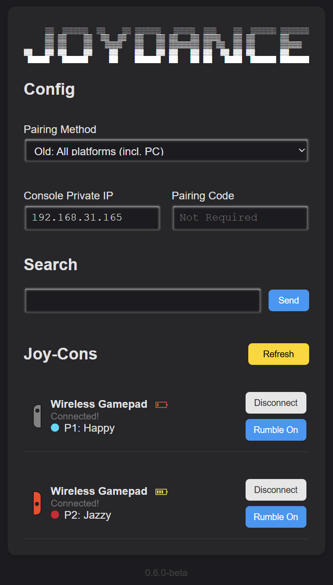

# JoyDance

[](https://ko-fi.com/W7W816C8NK)


> [!WARNING]
> This is a beta pre-release version, it still has bugs and wasn't tested on all platforms,
> Please leave bug reports in [issues](https://github.com/kzvdar42/joydance/issues)

<div style="text-align: center;">
    
</div>

## Demo
https://youtu.be/f_1IkUHFdH8

## Features
- Play Just Dance 2016-2022 on all platforms with Joy-Cons.
- Playing with a Joy-Con (+ its strap) is safer and more comfortable than holding a phone.
- No latency.
- Better score than using a phone (hopefully).
- No random disconnection.
- Support up to 6 players.
- Support all platforms:

|              | Xbox Series | Xbox One | PS4/5 | NSW | Stadia | PC | Wii U |
|--------------|:-----------:|:--------:|:-----:|:---:|:------:|:--:|:-----:|
| 2020-2022    | ✅          | ✅       | ✅    | ✅  | ✅    |    |       |
| 2016-2019    |             | ✅       | ✅    | ✅  |       | ✅ | ✅    |

  
## How does it work?
It pretends to be the [Just Dance Controller app](https://play.google.com/store/apps/details?id=com.ubisoft.dance.justdance2015companion), sends movements of the Joy-Con to your game console.

## Tested on
- MacOS Catalina 10.15 with [TP-Link Bluetooth 4.0 Nano USB Adapter UB400](https://www.tp-link.com/us/home-networking/usb-adapter/ub400/).
- Raspberry Pi Zero 2 W (Bullseye, kernel 5.15) with [MPOW BH519A Bluetooth 5.1 USB Adapter](https://www.xmpow.com/products/mpow-bh519a-bluetooth-5-1-usb-adapter-for-pc). Tested with 2 Joy-Cons and it worked just fine.
- Windows 11 23H2 with ORICO-BTA-408-PK (BT 4.0)

## Requirements
- PC/Mac/Linux with bluetooth support. Doesn't work with Chrome OS/Crostini ([#15](../../issues/15)).
- [Python 3.7+](https://www.python.org) and [pip](https://pip.pypa.io/en/stable/installation/) installed.
- 1 to 6 Joy-Cons.
- It's **RECOMMENDED** to:
  - Use a Bluetooth dongle, because built-in Bluetooth sucks (or you will get disconnected constantly while playing). Make sure you buy a dongle with game controllers support, not just for audio devices. Not all dongles support Mac/Linux, so remember to check compatibility before buying.
  - Use a Nintendo Switch to update Joy-Con to the latest firmware & calibate its motion sensors. Ask your friends or bring it to the game shop if you don't have one.


> [!WARNING]
> Bluetooth 5.0+ dongles seem to not be able to re-connect to previosly paired JoyCons, at least on Windows


## Installation

1. Download [the latest version](https://github.com/redphx/joydance/releases/latest/) and extract it into a folder.
2. Open that folder in Terminal/Command Prompt, then run this command:
```
pip3 install -r requirements.txt
```
  
#### Extra steps for Linux users
<details>
  <summary>Click to expand!</summary>

  1. Linux users may need to use [`hid`](https://github.com/apmorton/pyhidapi) instead of [`hidapi`](https://github.com/trezor/cython-hidapi) (not sure why `hidapi` couldn't find Joy-Cons on Linux).
  ```
  pip3 uninstall hidapi
  sudo apt install libhidapi-dev
  pip3 install hid
  ```

  2. Create a new udev rule file at `/etc/udev/rules.d/50-nintendo-switch.rules` ([Source](https://www.reddit.com/r/Stadia/comments/egcvpq/using_nintendo_switch_pro_controller_on_linux/fc5s7qm/))
  ```
  # Switch Joy-con (L) (Bluetooth only)
  KERNEL=="hidraw*", SUBSYSTEM=="hidraw", KERNELS=="0005:057E:2006.*", MODE="0666"

  # Switch Joy-con (R) (Bluetooth only)
  KERNEL=="hidraw*", SUBSYSTEM=="hidraw", KERNELS=="0005:057E:2007.*", MODE="0666"

  # Switch Pro controller (USB and Bluetooth)
  KERNEL=="hidraw*", SUBSYSTEM=="hidraw", ATTRS{idVendor}=="057e", ATTRS{idProduct}=="2009", MODE="0666"
  KERNEL=="hidraw*", SUBSYSTEM=="hidraw", KERNELS=="0005:057E:2009.*", MODE="0666"

  # Switch Joy-con charging grip (USB only)
  KERNEL=="hidraw*", SUBSYSTEM=="hidraw", ATTRS{idVendor}=="057e", ATTRS{idProduct}=="200e", MODE="0666"
  ```

  Reload udev rules:
  ```
  sudo udevadm control --reload-rules
  sudo udevadm trigger
  ```

  3. Install [`dkms-hid-nintendo`](https://github.com/nicman23/dkms-hid-nintendo) (Joy-Con driver) if you're running Linux kernel older than 5.16.
</details>

## Usage

1. Open the phone pairing screen on Just Dance.

2. Connect your PC/Mac/Linux to the same Wi-Fi or LAN network as your game console. For Stadia you just need to connect to the internet.

3. Run this command:
    ```
    python3 dance.py
    ```
    or
    ```
    python dance.py
    ```

4. Open http://localhost:32623 (not https://...) in a web browser (32623 = DANCE). You can also open JoyDance on another device (connected to the same network) with this link: `http://[JOYDANCE_DEVICE_IP]:32623` (for example: `http://192.168.1.100:32623`).

5. Turn on Bluetooth and pair with Joy-Con by holding down the [SYNC button](https://en-americas-support.nintendo.com/app/answers/detail/a_id/22634) until the light move up and down. Press the "Refresh" button until your Joy-Con shows up.

6. Fill the form.

    - **Pairing Method**:
      |                    | Default        | Fast      | Stadia    | Old                   |
      |--------------------|----------------|-----------|-----------|-----------------------|
      | Platforms          | All but Stadia | X1/PS/NSW | Stadia    | All, incl. PC & Wii U |
      | Game versions      | 2020-2022      | 2020-2022 | 2020-2022 | 2016-2019             |
      | Pairing Speed      | Slow           | Fast      | Slow      | Fast                  |
      | Pairing Code       | Require        |           | Require   |                       |
      | Private IP Address | Host           | Console   |           | PC/Console            |

    - **Host Private IP**:
      - The private IP address of your PC/Mac/Linux running JoyDance. Find this in the Wi-Fi settings.
      - Starts with `192.168.` or `10.`.
    - **PC/Console Private IP**:
      - The private IP address of your PC/console. Find this in the Wi-Fi settings on PC/console.
      - Starts with `192.168.` or `10.`.
    - **Pairing Code**: get this from the game.

7. Press the "Connect" button next to Joy-Con to start the pairing process.

8. 💃🕺

## Future Work
Plans for future work:
- [ ] Smooth out bugs
- [ ] Better support for reconnecting JoyCons
- [ ] Improve Just Dance 2016-2019 compatibility (not all input is supported)
- [ ] Add debug flag
- [ ] Proper executables and Docker container for ease of use

Maybe also this?
- [ ] Add support for Wii Remote?
- [ ] Support JDEXE?

Leave your suggestions in [issues](https://github.com/kzvdar42/joydance/issues)

## Support
If you'd like to support my efforts, you can do so through ko-fi or PayPal. However, please only contribute if you value the work that has been completed so far. I cannot promise ongoing support in the future. Currently, I am dedicated to refining and enhancing this project, but circumstances may change, such as personal issues, work deadlines, or the basic loss of motivation.

## FAQ
1. **What is the correct way to hold a Joy-Con?**  
  Please follow these images for [Joy-Con (L)](https://static.wikia.nocookie.net/justdance/images/2/20/Hold_joy-constrap_blue.png) and [Joy-Con (R)](https://static.wikia.nocookie.net/justdance/images/8/8a/Hold_joy-constrap_04.png).  
  
2. **How to control with Joy-Con (L)?**  

    | Joy-Con (L) | Joy-Con (R) |
    |-------------|-------------|
    | Up          | X           |
    | Right       | A           |
    | Down        | B           |
    | Left        | Y           |
    | L           | R           |
    | ZL          | ZR          |
    | Minus       | Plus        |

3. **How to exit JoyDance?**  
  Press `Ctrl + C` two times or close the Terminal window.

4. **Is it possible to port JoyDance to wearable devices like smart watches (Wear OS, watchOS...)?**  
  Yes. I tested on a tiny [M5StickC Plus](https://shop.m5stack.com/collections/stick-series/products/m5stickc-plus-esp32-pico-mini-iot-development-kit) and it worked! But remember, some movements require you to move only the palm of your hand won't be recognized correctly.

5. **Can I play Just Dance 2017 (PC) and run JoyDance on the same PC?**  
  Yes, you can.

6. **Why this is a fork?**
  Since the original creator of JoyDance, [redphx](https://github.com/redphx), is currently engaged in other projects, I decided to fork his work and carry it forward.

## Acknowledgements
-  [dekuNukem/Nintendo_Switch_Reverse_Engineering](https://github.com/dekuNukem/Nintendo_Switch_Reverse_Engineering)
-  [tocoteron/joycon-python](https://github.com/tocoteron/joycon-python)
-  [Davidobot/BetterJoy](https://github.com/Davidobot/BetterJoy)
-  [redphx/joydance up to v0.5.2](https://github.com/redphx/joydance)
